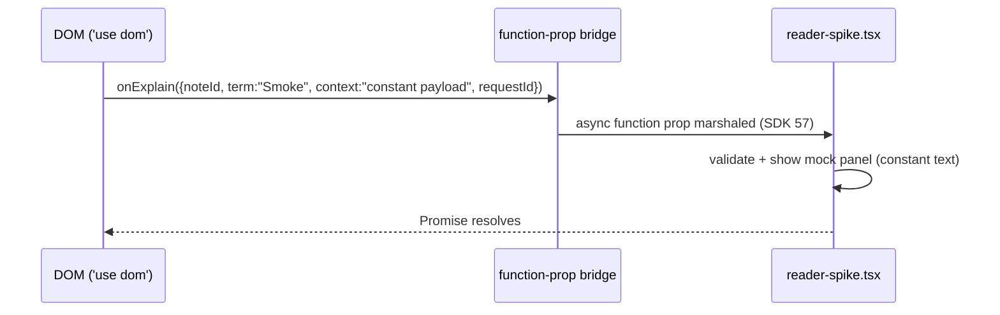
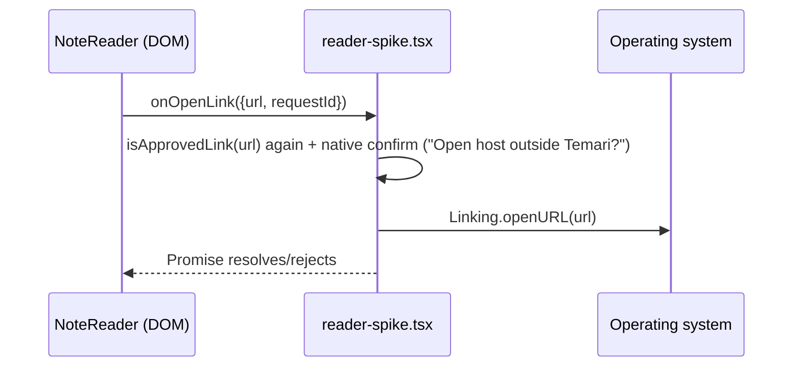
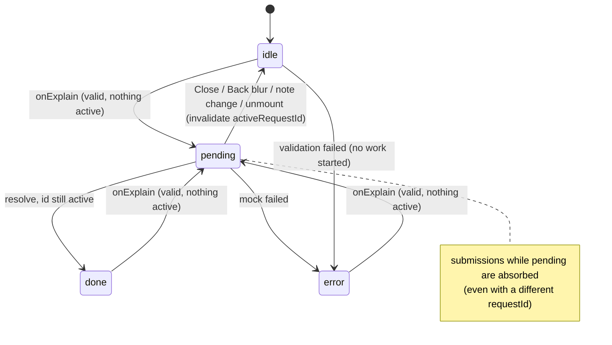

# M2 checkpoint B — implementation plan (v3)

Status: **ready to implement**, updated 2026-09-25 after the Phase-4 review.
Supersedes the v1 draft. v2 incorporated the review of 2026-09-24
(request-handler, sanitizer, callback-contract and link-policy corrections);
v3 incorporates the Phase-4 review of 2026-09-25 (session-handler extraction,
lifecycle consolidation, selection debounce/multi-block rejection/chip
placement, native link confirm) — the scope is unchanged, the corrections land
in §8–§12. Structured with the `show-me` skill's compact-visual guidance
(<https://github.com/humanlayer/skills/tree/main/plugins/show-me/skills/show-me>).
Phases 0–2 are implemented (PR #27). Phases 3–4 are implemented (2026-09-25,
branch `arena/01a0d998-temari`, steps 4.1a/4.1b/4.2/4.3). Phase 5 continues
from the [Phase 5 handoff](./M2-B-PHASE5-HANDOFF.md).

## 1. Scope and non-goals

Authoritative scope, unchanged: [`M2-READER-SPIKE.md` §Checkpoint B](./M2-READER-SPIKE.md)
— extract the rest of the content renderer (preserving web behavior/regression
tests), top-level async **mock** Explain action (bounded selection +
note/request ID, requestId + mounted-state guard, duplicate-tap prevention,
native result panel, no credentials/DOM nodes), approved HTTPS links only via an
explicit native action, final M2 preview gate. `ANDROID-PROTOTYPE-PLAN.md` §M2
items 1–2, 5–7 add the bridge shape and web-wrapper boundary.

```text
in scope
  renderer extraction into src/reader-core/ (plain source sharing, as at A)
  one Markdown + sanitization pipeline for web and the DOM reader
  typed DOM↔native action contract; single-active-request mock Explain
  native result panel; approved-HTTPS URL handoff to the OS
  web controls stay in NoteViewer (toolbar, print, downloads, reading place, toasts, morph origins)

out of scope (M3: import/SQLite/Library/Drill · M4: BYOK/API/SecureStore/paid confirm)
  persistence · real AI or paid calls · SQLite · SecureStore · import UI
  fetch/XHR/WS of any kind (the URL handoff is Linking.openURL, not a request)
```

Stack is settled and kept: `src/reader-core/` plain source sharing; **rehype-sanitize**
(no DOMPurify); one `'use dom'` component with top-level async function props and
`unstable_useExpoModulesBridge: false` (`apps/mobile/app/reader-spike.tsx`) — the
review confirms SDK 57 marshals these actions separately from the general
Expo-module bridge.

## 2. Decisions (settled)

| # | Decision | Resolution |
| --- | --- | --- |
| D1 | Phone/fixture look | **Reader lab styling at B** (`reader.css`). One renderer/component structure with presentation-specific class tokens — **not** two maintained component maps. Web keeps its exact DOM/classes. No Tailwind CLI extraction. |
| D2 | "Approved HTTPS" | Shared URL policy + **native** user confirmation. No domain allowlist at B. |
| D3 | Explain confirmation | DOM chip for the mock, and the chip labels the action as **mock** (not just the result panel). Native paid-request confirm stays M4. |
| D4 | Legacy pre-JSON diagram fences | `LegacyEditorialDiagram` stays web-only; mobile shows a clearly labelled source fallback. Legacy import parity recorded as **unresolved for M3**. |
| — | Task lists | Preserve disabled checkboxes via a small pre-sanitize input filter (§7.2), not via schema attribute rules alone. |
| — | Link confirmation | One **native** confirmation before `Linking.openURL`; no DOM confirm bar, no double confirm. |
| — | Request concurrency | **Single active request**; no supersede, no request-id history (§8.3). |

## 3. Target shape

```text
src/reader-core/
├── bridge.ts                # DOM↔native contract: types, bounds, validation, URL policy
├── selection/
│   ├── segmentTerm.ts       # moved from src/utils/segmentTerm.ts (termAtOffset, contextWindow)
│   └── termAtPoint.ts       # moved from NoteViewer.tsx:63–116 (recogniseTermAtPoint + selection helpers)
├── markdown/                # rehypeNoteRepairs/Callouts/Anchors (already here since A)
├── diagrams/
│   ├── FigureRenderer.tsx   # validated DiagramDoc → SVG (already here)
│   ├── FigureShell.tsx      # moved from src/components/diagrams/ (frame, caption, Error disclosure)
│   ├── FigureBlock.tsx      # NEW: fence routing (EditorialDiagram.tsx:43–57) + legacy slot
│   └── diagramDoc/figureTokens/layout.ts
├── NoteContent.tsx          # the shared content renderer: pipeline + one components map + skin tokens
├── NoteReader.tsx           # DOM host shell: selection→mock chip, status panel (evolved ReaderAssetSpike)
├── sanitize.ts              # readerSchema + rehypeTaskListInputs pre-filter entry
└── reader.css               # lab skin; selectors updated (§6.4)
src/components/notes/NoteViewer.tsx             # web wrapper only (§6.1)
src/components/diagrams/LegacyEditorialDiagram.tsx  # split out; web-only (D4)
src/utils/segmentTerm.ts    # re-export shim (existing compat pattern)
apps/mobile/
├── components/ReaderAssetSpikeDOM.tsx   # the one 'use dom' file: note fields + 2 action props
└── app/reader-spike.tsx                 # native: single-active handler, mock, result panel, link confirm
```

```diff
 <NoteViewer> (src/components/notes/NoteViewer.tsx)
   useReadingPlace() · toasts · copy/.md/print toolbar · print masthead
   long-press ring + term proxy chip · candidate Explain chip (MorphOrigin)
-  <ReactMarkdown> + markdownComponents + CalloutBlockquote   # :783–789, :408–545, :121–200
-  EditorialDiagram fence routing
+  <NoteContent skin="web" legacyFigure={LegacyEditorialDiagram} onTermActivate={…}>
```

## 4. Phase 0 — record checkpoint A's phone evidence

The A record still reads *"physical preview APK gate pending"*
(`M2-READER-SPIKE.md:3`). You have since tested checkpoint A on the phone.
Update that record **in place** (status line + short evidence note: device, OS,
WebView, dev-client vs preview APK, airplane-mode result, anomalies) instead of
repeating A's content here. This plan assumes the reported pass; the B gate
below retests the shared renderer anyway.

## 5. Phase 1 — bridge contract + tiny device action smoke (before any big move)

A proved assets render offline; it never proved the DOM→native function-prop
bridge. Do that first, on the smallest possible surface.

### 5.1 `src/reader-core/bridge.ts` — full target shape

```ts
export interface ExplainRequest {
  noteId: string;    // fixtures/mobile/reader-kitchen-sink.json "id"
  term: string;      // MIN_TERM_LENGTH..MAX_TERM_LENGTH inclusive (word or selection phrase)
  context: string;   // <= MAX_CONTEXT_LENGTH inclusive, code-point safe
  requestId: string; // newRequestId(): crypto.randomUUID() with timestamp-counter fallback
}
export interface OpenLinkRequest { url: string; requestId: string; }

/** Top-level async actions — the only DOM→native calls. Flat plain data. */
export type ExplainAction = (request: ExplainRequest) => Promise<void>;
export type OpenLinkAction = (request: OpenLinkRequest) => Promise<void>;

export const MIN_TERM_LENGTH = 2;
export const MAX_TERM_LENGTH = 60;      // inclusive; web's `text.length < 60` becomes <= 60
export const MAX_CONTEXT_LENGTH = 300;  // inclusive; builder clamps BEFORE dispatch (§8.2)
export const MAX_REQUEST_ID = 64;

/** Returns a fresh object with ONLY the permitted fields — never a pass-through. */
export function buildExplainRequest(input: {
  noteId: string; term: string; context: string;
}): ExplainRequest | null;                       // clamps context to 300, generates requestId

export function validateExplainRequest(
  expectedNoteId: string, raw: unknown,
): { ok: true; request: ExplainRequest } | { ok: false; reason: 'shape' | 'note-id' | 'term' | 'context' | 'request-id' };

/** One URL policy for rendering AND native validation (§7.3). */
export function isApprovedLink(url: string): boolean;
// true only for: absolute https: URL, non-empty host, no username/password, length <= 2048
// false for: relative, #fragment, //protocol-relative, http:, javascript:, data:, ftp:, file:, userinfo
```

DOM and native use the **same inclusive limits** and the same predicate —
validated results are rebuilt as fresh objects so extra properties cannot cross
the bridge.

### 5.2 Device action smoke



A temporary constant-payload button in the DOM shell → the real `onExplain`
prop → the native mock panel opens. Run this on the physical device **before**
Phase 2's extraction. If marshaling misbehaves, the failure is isolated to
`bridge.ts` + one screen instead of a half-moved renderer. Remove the button in
Phase 4 (or keep behind `development`).

Smoke evidence, 2026-09-24: all four steps passed per the user's screenshots
(button → MOCK panel with requestId, duplicate-tap absorbed, Close/back safe) —
on Expo web (`localhost:8081`), where function props are plain calls. The
Android WebView marshaling itself is therefore **not yet proven at B**; the
2-minute on-phone re-smoke is folded into the Phase 5 gate checklist.

## 6. Phase 2 — mechanical renderer extraction

Goal: web DOM byte-stable, web interaction path preserved. Sanitizer and link
changes are **not** in this phase (Phase 3, separate change).

### 6.1 What moves, what stays

```text
moves to reader-core (NoteContent.tsx / FigureBlock.tsx)
  processedContent citation normalization      NoteViewer.tsx:257–259  (single home: NoteContent)
  InPreContext + pre/code figure interception  NoteViewer.tsx:202, :408–471
  CalloutBlockquote                            NoteViewer.tsx:121–200
  components map (tables, headings, lists, a, hr)  NoteViewer.tsx:408–545
  fence routing                                EditorialDiagram.tsx:43–57
stays in NoteViewer (web wrapper)
  toolbar/copy/.md/print + Blob download        NoteViewer.tsx:355–387
  useReadingPlace / useReturnPoint / jumpTo     NoteViewer.tsx:550–557
  long-press ring + term proxy + candidate chip :264–343, :582–608, :686–726
  pointOrigin/MorphOrigin modal wiring          NoteViewer.tsx:30, :338
  katex CSS import                              NoteViewer.tsx:9 (CSS is host-owned)
```

### 6.2 Callback contract — DOM info stays inside the renderer family

The serialization restriction applies **at the Expo DOM/native boundary**, not
between ordinary DOM components. Keep the element through the web path; drop it
only when building a bridge payload:

```ts
export interface NoteContentProps {
  content: string;            // note.content RAW — normalization happens inside NoteContent
  noteTitle?: string;
  linkMode?: 'disabled' | 'web' | 'native-action';   // default: 'disabled' (§7.3)
  onOpenLink?: OpenLinkAction;                        // native-action mode only
  onTermActivate?: (term: string, context: string, element?: HTMLElement | SVGElement) => void;
  legacyFigure?: React.ComponentType<{ content: string; title?: string; figIndex?: number }>;
  skin: 'web' | 'reader';
}
```

```text
web:   FigureRenderer onNodeActivate → NoteContent → NoteViewer.onTermActivate(term, ctx, el)
                                                        └→ el drives the modal morph (preserved)
mobile:FigureRenderer onNodeActivate → NoteContent → NoteReader.onTermActivate(term, ctx)
                                                        └→ strings only → buildExplainRequest → native
```

Two extraction corrections from the review, adopted:

- Citation normalization lives in `NoteContent` only; `NoteViewer` passes
  `note.content`, not its own `processedContent`.
- `legacyFigure` receives the **split** `LegacyEditorialDiagram` (Phase 2 also
  splits it out of `EditorialDiagram.tsx:64–739`) — not `EditorialDiagram`,
  which would re-route the same fence through `parseDiagramFence` again.

### 6.3 One structure, two skin token maps (D1)

```ts
// one components map; presentation varies via tokens — never a second map
interface NoteSkin {
  callout(kind: string): { wrap: string; badge: string; label: string };
  calloutIcon?: (kind: string) => React.ReactNode;  // web: lucide Info/AlertTriangle/Lightbulb; reader: none
  codeBlock: string; inlineCode: string; tableWrap: string; // …one entry per slot
  linkButton: string;                                 // native-action mode
}
```

`skin="web"` reproduces today's class strings exactly (e.g. the callout wrapper
`note-callout p-4 my-4 rounded-r-xl border …` at `NoteViewer.tsx:181–191`), so
web markup is unchanged. `skin="reader"` maps the same structure onto `reader-*`
classes. `lucide-react` joins the reviewed allowlist in
`scripts/check-reader-boundary.mjs:5` (pure SVG components; no storage, network
or native APIs).

### 6.4 CSS corrections (do during the move)

- `reader.css` styles callouts as `blockquote[data-callout]`, but the web
  component renders a **div** (`NoteViewer.tsx:181`). Update the selectors to
  the shared wrapper when extracting.
- `reader.css`'s `.reader-figure svg { min-width: 480px; width: 100%; … }` must
  not catch lucide or other chrome icons — scope it to the diagram SVG (e.g.
  `.reader-figure svg[data-temari-fig]` or a direct-child combinator).

### 6.5 Definition of done

- `src/components/notes/NoteViewer.test.tsx` passes **unchanged** (SSR markup,
  callouts, figure numbering, determinism — note its evidentiary role: it pins
  markup, not clicks/selection/scroll; behavior preservation is additionally
  covered by §9's client-side tests and the fixture pass).
- New client-side test: a diagram click reaches the web callback **with its
  element** (morph-origin path intact).
- *Sequencing note (amended 2026-09-24):* the fixture rewires to `NoteContent`
  at Phase 3, not here — its security suite must flip in the same change that
  unifies the pipeline and introduces `linkMode`, keeping behavior diffs
  attributable (§11). During Phase 2 the fast loop is the web app's NoteViewer
  plus the `NoteContent` skin tests.

## 7. Phase 3 — sanitizer + explicit link policy (separate change)

### 7.1 Pipeline (one, for both hosts)

```diff
- [rehypeRaw, rehypeNoteRepairs, rehypeNoteCallouts, rehypeKatex, rehypeNoteAnchors]   # web today (NoteViewer.tsx:785)
+ [rehypeRaw, rehypeTaskListInputs, [rehypeSanitize, readerSchema],
+  rehypeNoteRepairs, rehypeNoteCallouts, rehypeNoteAnchors,
+  [rehypeKatex, { trust: false, maxExpand: 100, maxSize: 20 }]]
```

### 7.2 Inputs: pre-filter, don't trust schema attribute rules

Review correction, adopted: an attribute allowlist filters attribute **values**,
not elements, and hast-util-sanitize's handling of omitted top-level schema
fields (default `requiredAttributes` for `input`) can turn a disallowed text
input into a **disabled checkbox** instead of removing it. So:

```text
rehypeTaskListInputs()          // small targeted filter BEFORE rehype-sanitize
  for each <input> element
    type === 'checkbox'  -> keep, force disabled (and keep checked if set)
    anything else        -> remove the element entirely (with its content)
```

`readerSchema` then allowlists `input` with `['type','checkbox']`,
`['checked', true]`, `['disabled', true]` only. Tests cover checked/unchecked
task lists **and** hostile raw inputs (the fixture's
`<input name="credential" value="FAKE-ONLY" />` must disappear).

Two comment corrections to make while there (they were wrong in v1):

- `protocols: {}` in the current schema does **not** "deny every URL" — URLs
  are removed today because URL attributes (`href`/`src`) are not in the
  per-tag `attributes` allowlist at all.
- Sanitization does **not** always preserve text: elements in `strip`
  (forms, scripts, iframes…) lose their entire contents. Seed-note text
  comparison is supplementary coverage only (§9).

### 7.3 Links: explicit `linkMode`, one shared URL policy, native confirm

Presence of `onOpenLink` must not decide modality (an omitted callback must not
accidentally turn native-reader content into navigable anchors):

```ts
linkMode?: 'disabled' | 'web' | 'native-action';   // default 'disabled'
```

| `linkMode` | `https:` | scheme-less (`#sec-1`, `/app`) | `//host`, `http:`, other schemes |
| --- | --- | --- | --- |
| `disabled` (default) | inert text | inert text | inert text |
| `web` (only `NoteViewer` opts in) | `<a target="_blank" rel="noopener noreferrer">` | local path/fragment → `<a>` (today's behavior); `//host` → inert | inert |
| `native-action` | `<button type="button">` (real button, not `role=button` anchor) → `onOpenLink` | inert | inert |

- Rendering-time approval and native validation both call `isApprovedLink`
  (§5.1) — the sanitizer's `protocols: { href: ['https'] }` alone still admits
  scheme-less/protocol-relative values; it is not an absolute-HTTPS validator.
- `native-action` without an `onOpenLink` handler renders inert content.
- `skin` never affects link behavior — presentation only.



Wording rule: the app **hands the URL to the operating system outside the
reader** — `Linking.openURL` opens an installed handler (an HTTPS link may open
an associated app). In airplane mode the success criterion is this handoff, not
a loaded page.

Intentional web deltas from adopting the shared schema (document in the record;
guard with tests):

- Note **images** stop rendering (today web renders ``; the schema has no
  `img` — consistent with M2's "block remote images by default").
- Exotic authored tags (`<mark>`, `<abbr>`, `<details>`, …) unwrap to text.
- Dangerous link schemes: **not a new behavior** — react-markdown's default
  `urlTransform` already nulls `javascript:`-style URLs before components
  render; the explicit sanitizer is still required for raw-HTML event
  handlers, forms, frames, images and URL attributes.

### 7.4 Trusted chrome vs authored buttons

Fixture security assertions that blanket-`querySelector('button')` must be
reworked to distinguish:

```text
untrusted authored buttons/inputs/forms  -> removed by the pipeline (assert)
trusted application chrome               -> expected: native-mode link action buttons,
                                            FigureShell.Error "Show source" disclosure
```

## 8. Phase 4 — selection, single-active request, native panel, link confirm

### 8.1 Selection safeguards

- Both selection endpoints (`anchorNode`, `focusNode`) must be inside the
  note-content container; selections from the status panel, chips or other UI
  are ignored.
- **Debounce `selectionchange`** (Phase-4 review): Android fires it
  continuously while a selection handle is dragged; deriving a candidate per
  event thrashes the chip and re-renders the tree mid-drag. Derive once,
  ~250–300 ms after the last event — and capture `term` + `context` **at that
  settle moment**, before the Explain button changes focus/collapses the
  selection (never on chip tap).
- **Multi-block and oversized selections are rejected, not repaired**
  (Phase-4 review): collapse whitespace in the selected string; if the trimmed
  phrase exceeds 60 chars, or the anchor and focus blocks differ, show no
  chip. `contextWindow` assumes one text context — a phrase spanning a
  paragraph boundary or crossing into a figure yields garbage. Rejecting
  matches web behavior, which already caps at 60.
- **The chip is a fixed bottom bar inside the DOM, not a positioned popover**
  (Phase-4 review): Android's floating ActionMode toolbar (Copy/Share/Select
  all) owns the space above a selection in a WebView; a positioned chip fights
  it. One flex row of CSS sidesteps the whole overlap class.
- Word path (`termAtOffset`, ≤48 chars) and selection-phrase path (2..60
  inclusive) both feed `buildExplainRequest`.
- The builder clamps `context` to `MAX_CONTEXT_LENGTH = 300` before dispatch:
  `contextWindow` with a 60-char selection yields `120+60+120+2 = 302` chars
  (`segmentTerm.ts:29,119`) — the v1 constant would have failed its own
  validator.

### 8.2 Perf rules

`NoteContent` is `memo`ized with stable callback props; chip/pending/panel state
lives in the screen shell (outside `NoteContent`); the `'use dom'` component is
never re-keyed/remounted when the panel opens — so opening/closing the panel
preserves the reader's scroll position. The panel is a **native bottom card
sibling of the reader** (not a Modal — avoids modal Back-behavior at B).

Phase-4 review, adopted: "stable callbacks" means `useCallback` with **empty
deps reading refs** — not deps on session state. Every panel state change would
otherwise re-serialize the function props across the DOM bridge.

### 8.3 Single-active request — a pure, testable session factory (the v1 bug fix)

v1's `dispatch(submit)` + `await mockExplain(...)` let two calls start two mock
operations: a reducer ignoring `submit` does not stop the next line from
running. Phase-4 review, adopted: the corrected control flow lives in a **pure
factory in `reader-core`**, not in the Expo screen — the §9 call-count rows
must run in the web vitest suite, there is no RN harness for
`reader-spike.tsx` at checkpoint B (and none gets added), and the browser
fixture reuses the same factory so the fast loop and the phone run identical
semantics instead of parallel reimplementations.

```text
src/reader-core/session/createExplainSessionHandler.ts   # pure; no DOM/RN APIs

createExplainSessionHandler({ expectedNoteId, isAlive, isFocused, dispatch, run })
  -> { submit(raw), invalidate() }
// (extends the review's sketch with the note id `validateExplainRequest`
//  needs; a note change is invalidate + a new session)

submit(raw)                                  // the DOM action prop calls this
  if activeRequestId != null                 // ANY pending work, even another id
    return                                   // duplicate/rapid tap absorbed; no supersede at B
  checked = validateExplainRequest(expectedNoteId, raw)
  if !checked.ok
    dispatch(error(checked.reason))          // no work starts on invalid input
    return
  request = checked.request                  // fresh object, permitted fields only
  activeRequestId = request.requestId        // check-and-set BEFORE run
  dispatch(pending(request))
  try      settled = await run(request)      // exactly one op (tests count calls)
  catch    settled = reject('mock-failed')
  finally  if activeRequestId == request.requestId: activeRequestId = null
  if !isAlive() || !isFocused() || invalidatedSinceSubmit
    return                                   // stale: Close, blur, note change, unmount
  dispatch(settled)

invalidate()                                 // Close · note change · route blur · unmount
  activeRequestId = null                     // clears the guard too — see below
  dispatch(idle)
```

The screen (`reader-spike.tsx`) shrinks to wiring: refs, a tiny `useReducer`
for the view, and ONE `useFocusEffect` (below). The dev fixture's mock host
calls the same factory.



The stuck-guard hole (Phase-4 review): absorb-everything's classic failure
mode is an `activeRequestId` that never clears — an error path or a missed
invalidation wedges the session so nothing can ever submit again. `invalidate()`
and the `finally` block BOTH clear the guard; the fourth §9 test row (submit →
invalidate while pending → submit again succeeds) pins it.

One lifecycle mechanism (Phase-4 review): `useFocusEffect` alone covers
focus/blur AND mount/unmount for a focused screen, and its setup/cleanup
already behaves correctly under Strict Mode re-runs. One `useFocusEffect` sets
alive/focused on focus and calls `invalidate()` on blur — it replaces the
`useEffect` aliveRef pair entirely, and the factory is the single place
invalidation lands.

Rules: no request-id history; acceptance only when the completing id still
matches the session; invalidation on **Close**, note change, route blur and
unmount — all through `invalidate()`. View state stays a tiny reducer; it
renders `idle/pending/done/error` and is not the concurrency guard.
`try/catch/finally` keeps cleanup in the same request. Keep the
single-active-absorb-all simplification (Phase-4 review, explicit): no
supersede, no request-id history — easier to prove on a phone checklist than
supersede semantics; M4 can revisit cancellation if real AI needs it.

### 8.4 Mock content

Canned text echoing `term` and the first ~120 chars of `context`, labeled MOCK
end-to-end: the **chip** says the action is a mock (D3: "Run mock explanation…",
not merely the result panel), the panel header reads `MOCK · checkpoint B`. No
credentials, no network, no AI — same rule as the fixture's
`sk_test_reader_fixture_NOT_A_CREDENTIAL` authored text.

### 8.5 Native link confirm (Phase 4 implements §7.3's handoff)

- **`Alert.alert` is the confirm** (Phase-4 review): native, accessible,
  modal, free — not a custom sheet. The parsed **host** is shown prominently;
  the full URL is truncated below it.
- **Never `canOpenURL`** (Phase-4 review): on Android 11+ it returns false
  negatives without package-visibility `queries` entries. Just
  `try { await Linking.openURL(url) } catch { … error row }`.
- **Guard the link button's double-tap** (Phase-4 review): two rapid taps →
  two stacked Alerts is the same bug class as duplicate Explain. Route
  `OpenLinkRequest`s through the same single-flight guard as Explain —
  extracted beside the session factory so the §9 row stays a plain vitest
  test (a bare `confirmOpenRef` in the screen would push the test back onto
  the phone checklist).
- The §7.3 wording rule stays verbatim: the app hands the URL to the
  operating system outside the reader — in airplane mode the success
  criterion is that the OS handler opens (the handoff), not that anything
  renders.

## 9. Tests and gates

Roles, corrected: `NoteViewer.test.tsx` (kept unchanged) pins SSR **markup** —
callouts, figure numbering, determinism. It is not "proof of preserved web
behavior". Client-side tests + the fixture pass carry interaction.

Landed in Phases 2–3 (kept green): diagram click reaches the web callback with
its element · `native-action` without `onOpenLink` stays inert · hostile inputs
removed with task checkboxes disabled (§7.4 authored-vs-trusted split; seed-note
text comparison stays **supplementary** coverage only).

The Phase-4 concurrency rows run against the **pure session factory** in the
web vitest suite (Phase-4 review: no RN harness for the Expo screen at
checkpoint B — assert call counts on a mock `run`):

| New client-side test (factory, vitest) | Catches |
| --- | --- |
| Rapid submissions invoke `run` **once** (assert call count) | reducer-only "deduplication" |
| `invalidate()` while pending, then late completion stays dropped | result panel reopening |
| Invalid bridge payload starts **no** work (`run` never called) | validation existing only on paper |
| submit → `invalidate()` while pending → submit again **succeeds** | stuck active-request guard |
| Link double-tap → **one** confirm/handoff | duplicate-Explain bug class on links |

Iteration loop (cheap, every step): targeted vitest files + `bun run check:reader`
+ the browser fixture at 408px. Integration points only:

```sh
bun install --frozen-lockfile
bun run typecheck:all                  # web + packages/core + apps/mobile
NODE_ENV=test bun run test             # during iteration; build:render already runs this
NODE_ENV=production RENDER=true bun run build:render   # integration; includes test — don't double-run
# apps/mobile (integration):
bunx expo install --check
CI=1 bunx expo export --platform android --output-dir ../../.cache/m2-export
cd ../.. && bun run check:reader:export
```

Boundary/smoke updates: `check-reader-boundary.mjs` allowlist += `lucide-react`;
`smoke-reader.mjs` SSR-renders `NoteContent` + idle `NoteReader`;
`check-reader-export.mjs` expectations unchanged (one HTML doc, 24 embedded
WOFF2 `url(data:font/woff2;base64,…)`, no `@import`).

## 10. Final M2 preview gate (phone)

Diagnostics (font/CSP status panel) stay available in the preview build because
this checklist needs them. Preview APK, airplane mode **and Wi-Fi off**, cold
launch, no Metro.

1. Complete kitchen-sink: math, table, structured figure + `Fig. N`, nested
   callouts, repairs, Amharic, long scroll, fonts, CSP panel quiet.
2. Selection (native handles) → mock-labeled chip → run → native bottom-card
   result with term + requestId; **panel open/close preserves scroll position**.
3. Rapid double-tap → exactly **one** mock invocation; rapid double-tap on a
   link action → exactly **one** confirm (no stacked Alerts).
4. **Close while pending** and **Back while pending** → no panel, no crash, no
   state on a dead screen; late completion is dropped — and a fresh submission
   afterwards starts normally (the guard never sticks).
5. Diagram node tap → same mock flow with the node label.
6. HTTPS link → **native `Alert` confirm shows the host prominently with the
   full URL truncated** → confirm hands it to the OS
   outside the reader (in airplane mode, the handoff attempt is success — the
   external page need not load); cancel leaves the app in place; `//host`,
   relative, fragment and non-HTTPS links stay inert; imported HTML cannot move
   the WebView.
7. Re-run A's checks (fonts, Back, selection handles, scrolling).

Record device, OS, WebView version, build/artifact id. No EAS quota spent inside
Arena.

## 11. Implementation order (per review; each step ends green)

```text
0. Update the A record with the phone evidence        (Phase 0, docs only)
1. bridge.ts + tests, then the tiny device action smoke on your phone (Phase 1)
2. Mechanical extraction: selection/, FigureShell/FigureBlock, NoteContent,
   NoteViewer slim-down, legacy split, skin tokens + CSS fixes   (Phase 2)
3. Sanitizer + task-list filter + linkMode policy + security-test rework  (Phase 3)
4. Phase 4, review-ordered steps (Phase-4 review; each ends green):
   4.1 pure rename ReaderAssetSpike → NoteReader (isolated commit) + extract
       createExplainSessionHandler into reader-core + retarget reader-spike.tsx
       to it + the factory test rows, all in web vitest
   4.2 DOM selection: debounced selectionchange funnel, bounds/multi-block
       rejection, fixed-bottom mock-labeled chip, diagram taps through the
       same builder; verify in the browser fixture
   4.3 native link confirm: Alert.alert + isApprovedLink re-check + openURL in
       try/catch + double-tap guard; useFocusEffect lifecycle consolidation
   4.4 phase gates (§9's list; NoteViewer.test.tsx byte-unchanged)
5. Full gate matrix + phone checklist + checkpoint-B record (Phase 5)
```

Steps 2–4 are separable reviews/commits: the sanitizer/link policy deliberately
lands apart from the mechanical move so behavior diffs stay attributable.

## 12. Risks and open items

| Item | Handling |
| --- | --- |
| hast-util-sanitize `input` semantics (required-attribute defaults) | Pre-filter removes the ambiguity; tests decide — verify against the installed version during Phase 3, don't trust either of our summaries |
| Legacy pre-JSON fences on imported notes | D4: labelled source fallback now; **legacy import parity = unresolved, M3 decision** |
| Android WebView selection event quirks | ONE debounced `selectionchange` derive (250–300 ms settle; touchend/mouseup only re-arm it); container-scoped; fixed-bottom chip clear of the ActionMode toolbar; re-probed at the gate |
| Expo screen logic untestable from web vitest | Session control flow lives in the pure reader-core factory; the screen is wiring only (§8.3) — no RN harness added at checkpoint B |
| Stuck single-active guard (absorb-all failure mode) | `invalidate()` and `finally` both clear the guard; the resubmit-after-close factory test pins it (§9) |
| Function-prop marshaling surprises | Phase 1 device smoke isolates this before the big extraction |
| Sanitizer deltas to web (images, exotic tags) | Documented §7.3; supplementary seed-note tests; review diff of `readerSchema` in the PR |

Standing rules unchanged: no merges, no `main` interaction, no workflow files,
no Render changes, no new EAS projects (`ANDROID-PROTOTYPE-PLAN.md`).
